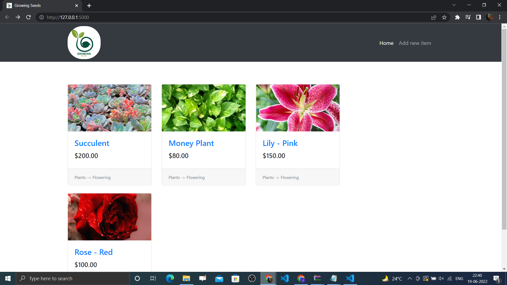
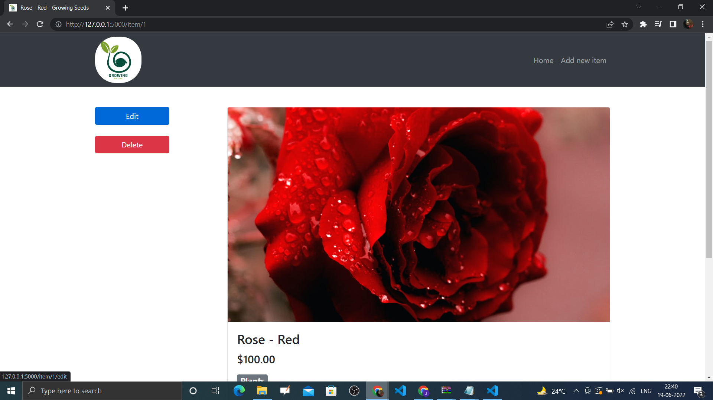
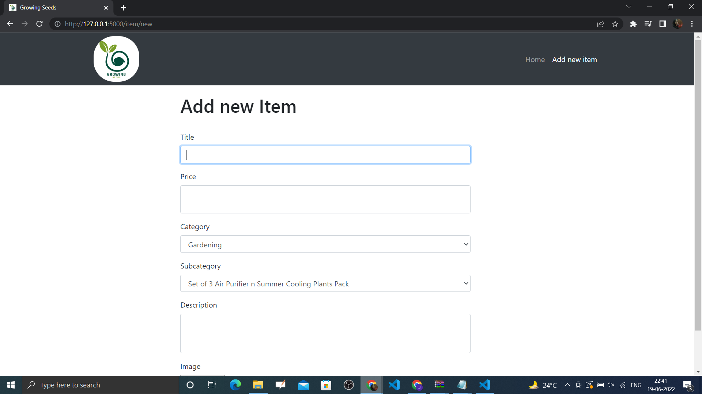
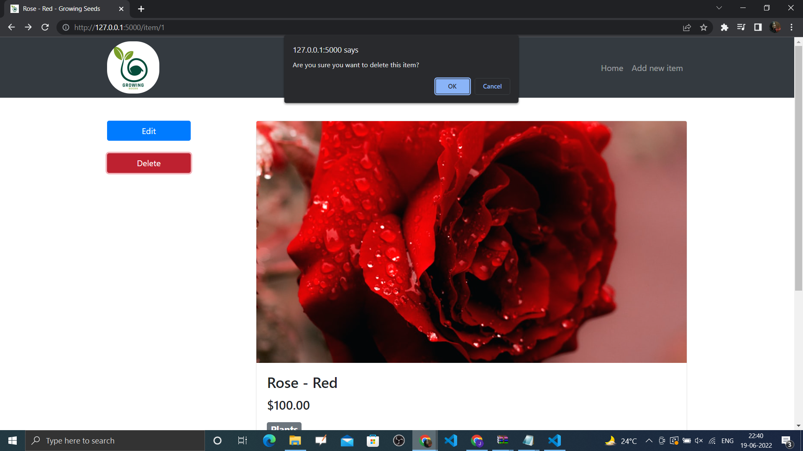
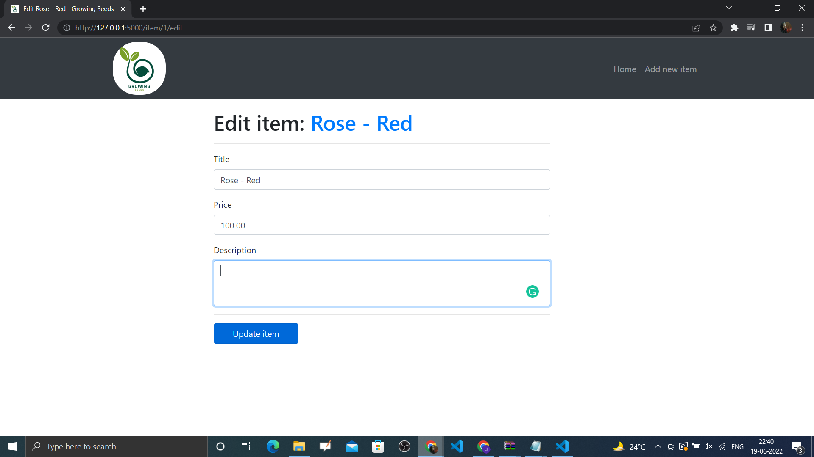

# flaskWebForms

To Run it Locally 
- Create Virtual Environment 
- virtualenv venv
- source venv/bin/activate
- Venv will be activated
```pip install flask
- pip freeze > requirements.txt
- pip install -r requirements.txt
- export FLASK_APP=run
- export FLASK_ENV=development
- flask run
```


## Flask WebApp with CRUD operations 
- Home Page
 


- Item Page



- Add New Item Page 



- Delete Item



- Edit Item


